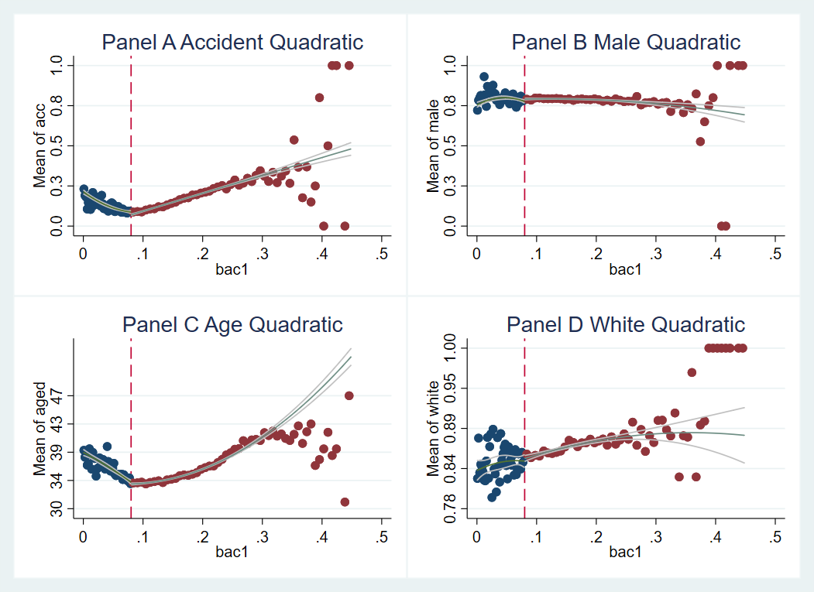
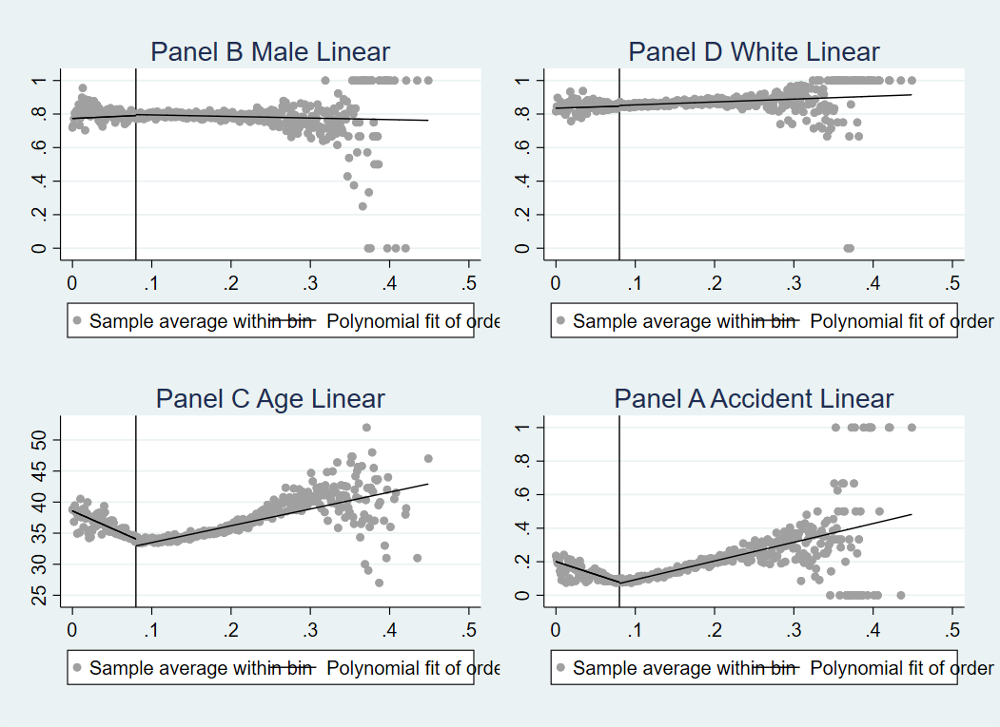
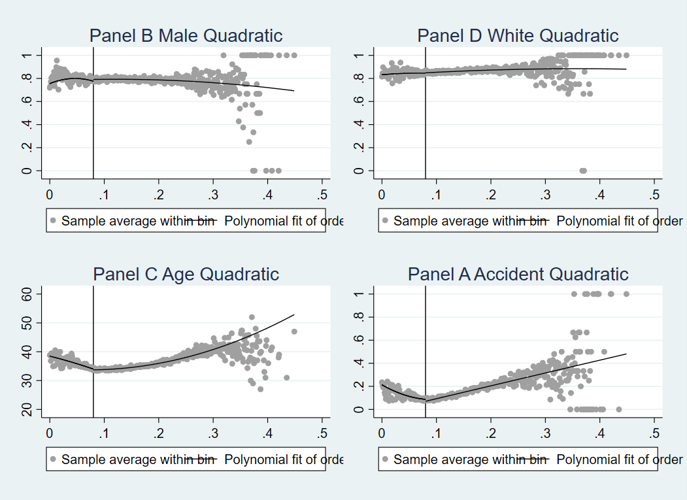
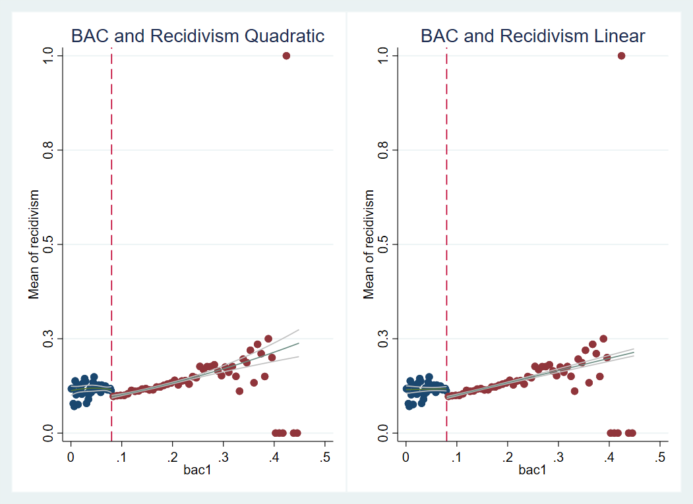
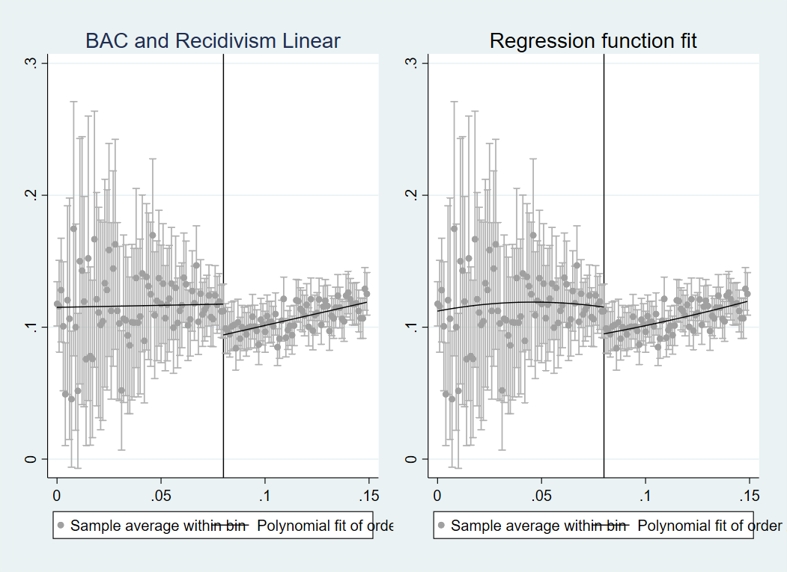

```{r setup, include=FALSE}
knitr::opts_chunk$set(echo = TRUE)
```

```{r, echo=FALSE, message=FALSE, warning = FALSE}
library(readr)
library(tidyverse)
library(ggplot2)
library(readr)
library(dplyr)
library(tidyr)
library(rdd)
library(haven)
library(estimatr)
library(rdrobust)
library(rddensity)
library(cli)
library(kableExtra)
library(stargazer)

library(Statamarkdown)
stataexe <-"C:/Program Files/Stata16/StataIC-64.exe"
knitr::opts_chunk$set(engine.path=list(stata=stataexe))


```


```{r, echo=FALSE, message=FALSE }

raw_hansen_dwi <- read_csv("Data/hansen_dwi.csv")

```

````{stata, echo=FALSE, message=FALSE}
sysuse "C:\Users\megan\Documents\UT\Spring 2021\Casual Inference\Replications\RDD Replication Final\EllertsonRDD\Data\hansen_dwi.dta"

sum hansen_dwi
 
```
**Unable to change STATA directory within R**

## Question 1

The link below is connected to my github repository, which I have labeled (**EllertsonRDD**)[https://github.com/meganellertson/EllertsonRDD.git] due to the fact that I have another repository called RDD in my github currently. As an additional note, I began this assignment in both R and STATA. Given I am very new to R and have some prior experience in STATA, I wanted to take this opportunity to learn R and supplement what I was unable to figure out in R with the STATA software. Thus, I utilize both R and STATA code and output through this markdown page. My final do.file and figures from STATA are also located in the (**EllertsonRDD**)[https://github.com/meganellertson/EllertsonRDD.git] repository on github for specifics on my process in STATA if not fully displayed in the code for this markdown page. 

https://github.com/meganellertson/EllertsonRDD.git

## Question 2 

Summary
*Punishment and Deterrence: Evidence from Drunk Driving* (Hansen, 2015) attempts to understand the effect of harsher punishments and sanctions on recidivism, particularly related to drunk driving and DUIs.  Hansen attempts to further the literature on contradictory conclusions provided by prior criminologists and economists on this topic. In this analysis Hansen analyzes the policy of the DUI, through the blood alcohol content thresholds and a quasi-experimental design to understand the effect that harsher punishment has on people's inclination to repeat a crime, specifically drinking and driving. Hansen utilizes DUI BAC test data from the state of Washington between 1999 and 2007, this specific time frame allows for the examination of a four year recivisims window as well as the constant nature of the BAC thresholds at 0.08 and 0.15 (aggravated DUI) after 1999.  The analysis ensures to look at individuals over the age of 21 given the behavior and punishment for drunk driving is very different. Hansen utilizes a McCrary Density test prior to local linear regression discontinuity design to ensure that the estimates are unbiased. Given the McCrary Density test, Hansen finds that there is no evidence of “endogenous sorting” or, more planely, that at the cutoff individuals are randomly getting slightly above or slightly below the DUI threshold. This means they cannot sort themselves or be sorted into or out of the DUI charge, it is just locally random. Hasen does confirm this through the density test, and thus can proceed with the regression discontinuity. He utilizes a local linear regression discontinuity to obtain the estimates with slopes that change at the discontinuity and with rectangular kernels.  The indicator variable, or dummy variable is when the BAC level is at or above 0.08 or in the case of the aggravated DUI: at or above 015. There are additional controls included such as age, gender, accident at the scene, and race. The running variable is the minimum between the two BAC tests provided at the scene which are usually very close in value. Hansen finds that these punishments do reduce recidivism. He finds that having a BAC at the DUI level or above decreases recidivism by 2 percentage points during the four years after the initial conviction (this is statistically significant at the 1%).  Similar results are found for the aggravated DUI level. The study also looks at how increasing severity of punishment impacts diversion. He finds that a 10% increase in sanctions for drunk driving reduces the act by 2.3%.  Hansen also addresses some other factors which contribute to recidivism rates such as incapacitation,rehabilitation and deterrence.  Deterrence ends up being the primary way for addressing this.Although Hansen also notes that the identification strategy is limited due to the inability to assess the effect of more severe punishments and testing for those who are first time offenders.

Question 3

The cutoff variable is related to the running variable, in that it is a treatment or cutoff of the range of the running variable. In this case, the dummy variable that will be created is in relation to the BAC level of the individual, specifically at the point they would be given a DUI (BAC = 0.08).  In the paper Hansen also focuses on aggrivated DUI, but this analysis will be focusing on one cutoff at the 0.08 threshold. This can be done in STATA or R by simply creating a new variable contingent upon the value of the BAC variable which already exists in the data set. The following Summary Statistics table provides more isnight into the nature of the data. 
```{r, echo= FALSE, message=FALSE }
RDDdata <- raw_hansen_dwi %>%
  mutate(dui = car::Recode(bac1, "lo: 0.08=0; else = 1"))

``` 
```{stata, echo=FALSE, message=FALSE}

```

```{r, echo = FALSE }
sumstat = data.frame(
  Measure = c("Recidivism", "BAC", "DUI", "Male", "Accident", "Age", "White"),
  M_1  = c(mean(RDDdata$recidivism), mean(RDDdata$bac1), 
             mean(RDDdata$dui), mean(RDDdata$male), 
             mean(RDDdata$acc), mean(RDDdata$aged), 
             mean(RDDdata$white)),
  Sd_1 = c(sd(RDDdata$recidivism), sd(RDDdata$bac1),
              sd(RDDdata$dui), sd(RDDdata$male),
              sd(RDDdata$acc),sd(RDDdata$aged), 
              sd(RDDdata$white)),
  Min_1 = c(min(RDDdata$recidivism), min(RDDdata$bac1), 
              min(RDDdata$dui), min(RDDdata$male),
              min(RDDdata$acc),min(RDDdata$aged), 
              min(RDDdata$white)),
  Max_1 = c(max(RDDdata$recidivism), max(RDDdata$bac1), 
              max(RDDdata$dui), max(RDDdata$male), 
              max(RDDdata$acc), max(RDDdata$aged), 
              max(RDDdata$white))
            
)
sumstat %>%
  kable(
  col.names = c("Variables", "Mean", "Standard Deviation", "Minimum", "Maximum"),
  digits = 2,
  caption = "Summary Statistics Table"
) %>%
  kable_classic(full_width = F, html_font = "Cambria")
```
The table shows that many of the variables of concern are binary and take the value of either 0 or 1. The data only looks at individuals of a legal drinking age, 21 and the highest age of 80. Much of the individuals pulled over for drunk driving are white with a mean of 0.84 and are usually men. The maximum BAC level reported in the data set is 0.45, which is much higher than even the aggravated BAC level. 

Question 4

The following recreates the frequency distribution which is the method Hansen chooses to visualize the potential sorting behavior along the running variable which may be a form of manipulation. This is important to understand because, if individuals were able to control or sort themselves into the treatment group, it would take away from the ability to utilize the RDD method to draw any casual effects. The sorting would be cause for basis and would change the meaning of the results. 


```{r, echo = FALSE}
figure1 <- ggplot(RDDdata, aes(bac1)) +
  geom_histogram(binwidth = 0.001, color = "grey", fill = "white") 
figure1 + geom_vline(aes(xintercept = 0.08), color = "black", size = 1) +
  geom_vline(aes(xintercept = 0.15), color = "black", size = 1) +
  labs(title = "BAC Histogram", x = "bac1", y = "Frequency")
```
Visually, the frequency distribution appears very smooth, and there appears to be no bunching behavior around the cutoff which is indicated by the vertical line. The 0.15 line is included as well to remain as consistent with Hansen's figure as possible. Although visually, this appears may provide for some confidence to the lack of endogenous sorting, it may be more effective to use an additional density test, the McCrary Density test to ensure this conclusion.  
```{r, message = FALSE}

density <- rddensity(RDDdata$bac1, c = 0.08, kernel = "uniform")
summary(density)
rdplotdensity(density, RDDdata$bac1)

```
The output of this test provide a p-value of 0.9595. Given the high p-value there is substantial evidence that there is no endogenous sorting impacting the data. This allows the RDD method to move forward with the ability to draw casual effect conclusions. Additionally, a density plot is produced which visualizes the cutoff of 0.08, the black line is prior to the cutoff and the red line is after the cutoff or the portion of the sample which would have received DUIs. It would make sense that there would not be sorting in the running variable for a few reasons, many of which are pointed out in Hansen's paper. Given the running variable is BAC, it is an extremely difficult measurement for an individual to control and particularly to control right at the DUI level. The BAC is very specific to the individuals body, and their activities, not to mention the difficulty in judgment one would suffer if they were even to attempt to control their BAC while drinking. Additionally, how the BAC is measured is extremely precise, therefore, it would be difficult to control for at such a specific level. 

A similar processes can be completed in STATA, as outputted below. Although conducted with similar commands, the package provided in STATA outputs a slightly different P-Value however,it still provides the same conclusions as drawn in R. 

Question 5 

The following is the first equation specified by Hansen for the estimation method. In this equation the variable recidivism is the dependent variable for every "i" individual, the large "X" is the vector of the covariates which are being controlled for, such as sex, age and race. Then there are independent variables estimations for the indicator variable for DUI, the BAC level and then the interaction between the two. 

Equation 1
$y_i = X_i'\gamma +\alpha_1DUI_i + \alpha_2BAC_i +\alpha_3BAC_i *DUI_i +u_i$

The next step is to check the covariate balance, which recreates the first panel of Table 2 in Hansen's paper. The following is the STATA version of this table. 
```{stata} 
rdrobust male bac1, c(0.08) h(0.05) kernel("uniform")
estimates store Male, title(Male)
rdrobust white bac1, c(0.08) h(0.05) kernel("uniform")
estimates store White, title(White)
rdrobust aged bac1, c(0.08) h(0.05) kernel("uniform")
estimates store Age, title(Age)
rdrobust acc bac1, c(0.08) h(0.05) kernel("uniform")
estimates store Accident, title(Accident)

estout Male White Age Accident, cells(b(star fmt(4)) se(par fmt(4))) stats(N, labels(N)) label legend varlabels(RD_Estimate "Panel A DUI Threshold")
```
As well as the R version of the table. The estimates are slightly different due to the different packages, user-ability to manipulate the commands and methods  between the two software. 
```{r, results = 'asis'}
malecov <- RDestimate(formula = male ~ bac1 | aged + acc + white + dui + bac1*dui, data = RDDdata, cutpoint = 0.08, bw = 0.05, kernel = "rectangular", se.type = "HC1")


agecov <- RDestimate(formula = aged ~ bac1 | male + acc + white + dui + bac1*dui, data = RDDdata, cutpoint = 0.08, bw = 0.05, kernel = "rectangular", se.type = "HC1")


acccov <- RDestimate(formula = acc ~ bac1 | aged + male + white + dui + bac1*dui, data = RDDdata, cutpoint = 0.08, bw = 0.05, kernel = "rectangular", se.type = "HC1")

whitecov <- RDestimate(formula = white ~ bac1 | aged + male + acc + dui + bac1*dui, data = RDDdata, cutpoint = 0.08, bw = 0.05, kernel = "rectangular", se.type = "HC1")

CovBal = data.frame(
  Estimates = c("Coeff", "SE", "Z", "P-Value", 
                "Confidence Interval"),
  m = c(malecov$est[1], malecov$se[1], malecov$z[1],
        malecov$p[1], malecov$ci[1]),
  w = c(whitecov$est[1], whitecov$se[1], whitecov$z[1],
        whitecov$p[1], whitecov$ci[1]),
  ag = c(agecov$est[1], agecov$se[1], agecov$z[1],
         agecov$p[1], agecov$ci[1]),
  acc = c(acccov$est[1], acccov$se[1], acccov$z[1],
          acccov$p[1], acccov$ci[1])
)

CovBal %>%
  kable(
  col.names = c("Characteristic", "Male", "White", 
                "Age", "Accident"),
  digits = 3,
  caption = "Covariate Balance Panel A Only"
) %>%
  kable_classic(full_width = F, html_font = "Cambria")


```
Although slightly different than Hansen's paper, but this output provides the same lack of statistical significance. This means that there is a failure to reject the null hypothesis that the characteristics are unrelated to the cutoff. This is somewhat of an issue for the overall RDD estimation. This means there are individual effects from the characteristics impacting the jumping behavior at the BAC cutoff on their own, with could cause misinterpretation of cutoff discontinuity estimation while focusing on recidivism. Question 6 allows for further exploration into the visualization of these characteristics. 

## Question 6

Figure 2 from Hansen looks at the covariate balance. This takes into account the covariates which will be used to control for. We must examine how these interact with the running variable individually to draw more consistent and unbiased conclusions from our full RDD estimates. The visualization of this covariate specific understanding looks at the shape of the scatter plots around the cutoff, as well as the shape of the relationship of the covariate along the running variable. The first provided set of graphs is created and combined with STATA, this provides a linear fit for the scatter plot on either side of the cutoff. The following is both the linear and the quadratic fit for these regressions, and uses the cmogram command in STATA. 
```{stata}
cmogram acc bac1, cut(0.08) scatter line(0.08) lfitci title("Panel A Accident Linear") 
**Figure3.gph
cmogram male bac1, cut(0.08) scatter line (0.08) lfitci title("Panel B Male Linear")
**Figure4.gph
cmogram aged bac1, cut(0.08) scatter line(0.08) lfitci title("Panel C Age Linear")
**Figure5.gph
cmogram white bac1, cut(0.08) scatter line(0.08) lfitci title("Panel D White Linear")
**Figure6.gph

graph combine Figure3 Figure4 Figure5 Figure6, replace 
**linear.gph
```




The image can also be created with the rdd package. 
```{stata, echo = FALSE}

rdplot male bac1, c(0.08) p(1) bw(0.05) graph_options(title("Panel B Male Linear"))
**Figure7.gph
rdplot white bac1, c(0.08) p(1) graph_options(title("Panel D White Linear"))
**Figure8.gph
rdplot aged bac1, c(0.08) p(1) graph_options(title("Panel C Age Linear"))
**Figure9.gph
rdplot acc bac1, c(0.08) p(1) graph_options(title("Panel A Accident Linear"))
**Figure10.gph

graph combine Figure7 Figure8 Figure9 Figure10, replace 
**linear2.gph

```


It is somewhat difficult to the see the difference in the shape of the line due to the size and compactness of the combined graphs. But also this shows the direction of the scatter plot is fairly uniform on either side of the cutoff. This is a larger generalization of the overall.  There seems to be a common trend of a large spead which happens across characteristics at the upper end of the BAC running variable. 
The trend lines of these character plots should remain unchanged or smooth as they cross the threshold of the BAC 0.08 level. The visuals are consistent with the output generated by the Table 2 estimates.  These visuals displace some discontinuity across the cutoff at for these characteristics. 


## Question 7

```{r}

RDD7a <- RDDdata %>%
  mutate(bac7 = bac1 - 0.08,
         dui7 = ifelse(bac7 >= 0, 1, 0),
         bacsq7 = bac7^2) %>%
  filter(bac7>=-0.05 & bac7<=0.05)

RDD7b <-RDDdata %>%
  mutate(bac7 = bac1 - 0.08,
         dui7 = ifelse(bac7 >= 0, 1, 0),
         bacsq7 = bac7^2) %>%
  filter(bac7>=-0.025 & bac7<=0.025)


weightsa <- rdd::kernelwts(RDD7a$bac7, center = 0, bw = 0.05, kernel = "rectangular")
weightsb <- rdd::kernelwts(RDD7b$bac7, center = 0, bw = 0.05, kernel = "rectangular")
C1PA <- lm(recidivism ~ bac7 + dui7 + aged + white + male + acc, 
           data = RDD7a,
           weights = weightsa)
lmtest::coeftest(C1PA, vcov = sandwich::vcovHC(C1PA))
C2PA <- lm(recidivism ~ bac7*dui7 + aged + white + male + acc, 
           data = RDD7a,
           weights = weightsa)
lmtest::coeftest(C2PA, vcov = sandwich::vcovHC(C2PA))
C3PA <- lm(recidivism ~ dui7*(bac7 + bacsq7) + aged + white + male + acc, 
           data = RDD7a,
           weights = weightsa)
lmtest::coeftest(C3PA, vcov = sandwich::vcovHC(C3PA))

C1PB <- lm(recidivism ~ bac7 + dui7 + aged + white + male + acc, 
           data = RDD7b,
           weights = weightsb)
lmtest::coeftest(C1PB, vcov = sandwich::vcovHC(C1PB))
C2PB <- lm_robust(recidivism ~ bac7*dui7 + aged + white + male +
                    acc, 
           data = RDD7b,
           weights = weightsb)
lmtest::coeftest(C2PB, vcov = sandwich::vcovHC(C2PB))

C3PB <- lm_robust(recidivism ~ dui7*(bac7 + bacsq7) + aged + white + male + acc, 
           data = RDD7b,
           weights = weightsb)
lmtest::coeftest(C3PB, vcov = sandwich::vcovHC(C3PB))

##Table formatting 
C3PB$est[]
CovBal = data.frame(
  Estimates = c("Coeff", "SE", "Z", "P-Value", 
                "Confidence Interval"),
  m = c(malecov$est[1], malecov$se[1], malecov$z[1],
        malecov$p[1], malecov$ci[1]),
  w = c(whitecov$est[1], whitecov$se[1], whitecov$z[1],
        whitecov$p[1], whitecov$ci[1]),
  ag = c(agecov$est[1], agecov$se[1], agecov$z[1],
         agecov$p[1], agecov$ci[1]),
  acc = c(acccov$est[1], acccov$se[1], acccov$z[1],
          acccov$p[1], acccov$ci[1])
)

CovBal %>%
  kable(
  col.names = c("Characteristic", "Male", "White", 
                "Age", "Accident"),
  digits = 3,
  caption = "Covariate Balance Panel A Only"
) %>%
  kable_classic(full_width = F, html_font = "Cambria")

```

## Question 8
```{stata, evaluate = FALSE}
cmogram recidivism bac1, cut(0.08) scatter line(0.08) qfitci title("BAC and Recidivism Quadratic")
**Figure19.gph
cmogram recidivism bac1, cut(0.08) scatter line(0.08) lfitci title("BAC and Recidivism Linear")
**Figure20.gph

graph combine Figure19 Figure20 
**Basic.gph

rdplot recidivism bac1 if bac1 < 0.15, c(0.08) p(1) ci(95) graph_options(title("BAC and Recidivism Linear"))
**Figure21.gph
rdplot recidivism bac1 if bac1 < 0.15, c(0.08) p(2) ci(95) graph_option(title("BAC and Recidivism Quadratic"))
**Figure22.gph

graph combine Figure21 Figure22
**Basic2.gph

```




There are two provided options in STATA for visualizing these figures. The top, which uses the cmogram command, but can not be cutoff at the 0.15 point, and then

## Question 9


